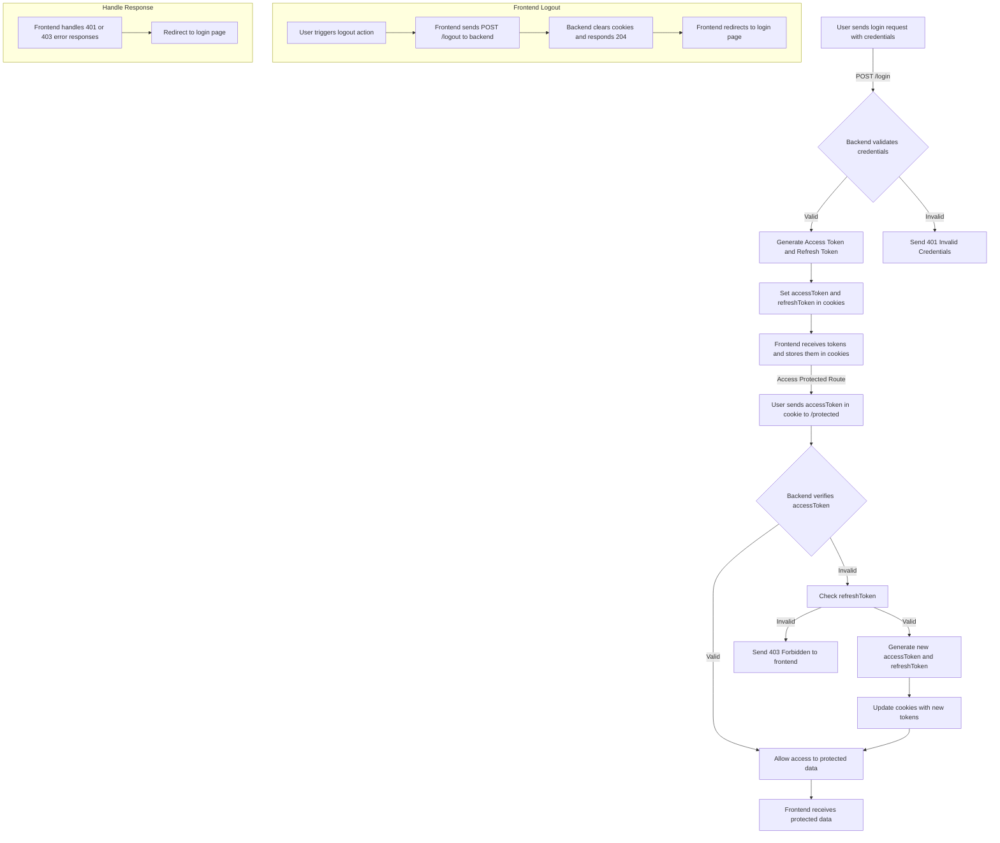

Example For nuxt SSR with Http-Only Cookie with refresh token 

```mermaid
flowchart TD
    A[User sends login request with credentials] -->|POST /login| B{Backend validates credentials}
    B -->|Valid| C[Generate Access Token and Refresh Token]
    B -->|Invalid| D[Send 401 Invalid Credentials]

    C --> E[Set accessToken and refreshToken in cookies]
    E --> F[Frontend receives tokens and stores them in cookies]

    F -->|Access Protected Route| G[User sends accessToken in cookie to /protected]
    G --> H{Backend verifies accessToken}
    H -->|Valid| I[Allow access to protected data]
    H -->|Invalid| J[Check refreshToken]

    J -->|Valid| K[Generate new accessToken and refreshToken]
    K --> L[Update cookies with new tokens]
    L --> I

    J -->|Invalid| M[Send 403 Forbidden to frontend]

    I --> N[Frontend receives protected data]

    subgraph Frontend Logout
        O[User triggers logout action] --> P[Frontend sends POST /logout to backend]
        P --> Q[Backend clears cookies and responds 204]
        Q --> R[Frontend redirects to login page]
    end

    subgraph Handle Response
        S[Frontend handles 401 or 403 error responses] --> T[Redirect to login page]
    end
```
